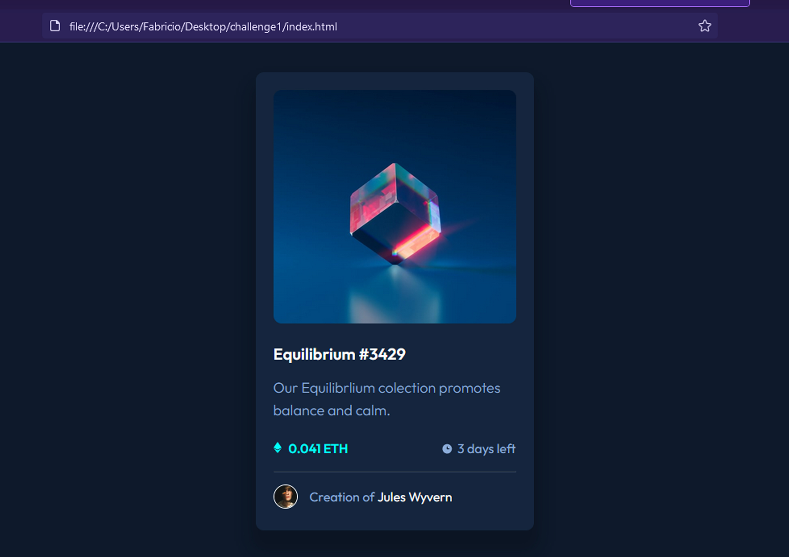

# Frontend Mentor - NFT preview card component solution

This is a solution to the [NFT preview card component challenge on Frontend Mentor](https://www.frontendmentor.io/challenges/nft-preview-card-component-SbdUL_w0U). Frontend Mentor challenges help you improve your coding skills by building realistic projects.

## Table of contents

- [Overview](#overview)
  - [The challenge](#the-challenge)
  - [Screenshot](#screenshot)
  - [Links](#links)
- [My process](#my-process)
  - [Built with](#built-with)
  - [What I learned](#what-i-learned)
  - [Continued development](#continued-development)
- [Author](#author)

**Note: Delete this note and update the table of contents based on what sections you keep.**

## Overview

### The challenge

Users should be able to:

- View the optimal layout depending on their device's screen size
- See hover states for interactive elements

### Screenshot

### Links

- Solution URL: [https://github.com/FabricioRivera2021/nft-card](https://github.com/FabricioRivera2021/nft-card)
- Live Site URL: [https://fabriciorivera2021.github.io/nft-card/](https://fabriciorivera2021.github.io/nft-card/)

## My process

I start with the structure of the html, after i had that i start adding styles as i need them, i think that made up the code in the styles look a little messy, in the process of doing that i was also creating new classes and id, the last part was creating the hover effects, and a little
tweaking of the dimensions after that.
Note - i tried to do a mobile first aproach, i never do anything like it, so i dont know if it was right or wrong.

### Built with

- HTML5
- CSS
- Flexbox

### What I learned

I really like this proyect to practice some html and css, and it help realize that i need much more practice with the structure of the page
like when to do an ID or a CLASS. In the end ir turn out a little messy but i think it has the same look as the preview image.
And i strugle a little with the hover on the image, at first i didnt know how to do it, but in the end i came up with an idea.

### Continued development

I would keep trying to figure it out how to make a better structure in html. And make a better decicion in the way i make the classes and ids.
And also tying to learn more about variable units (i know some about them), i didnt use them in this proyect.

## Author

- Frontend Mentor - [@FabricioRivera2021](https://www.frontendmentor.io/profile/FabricioRivera2021)
- GitHub - [FabricioRivera2021](https://github.com/FabricioRivera2021)
